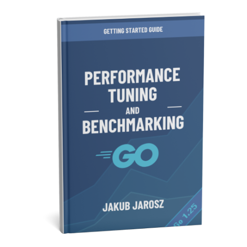

# Performance Tuning and Benchmarking in Go

This repository contains the code examples for the book [*Performance Tuning and Benchmarking in Go*](https://jarosz.dev/article/performance-tuning-and-benchmarking/), by Jakub Jarosz.

